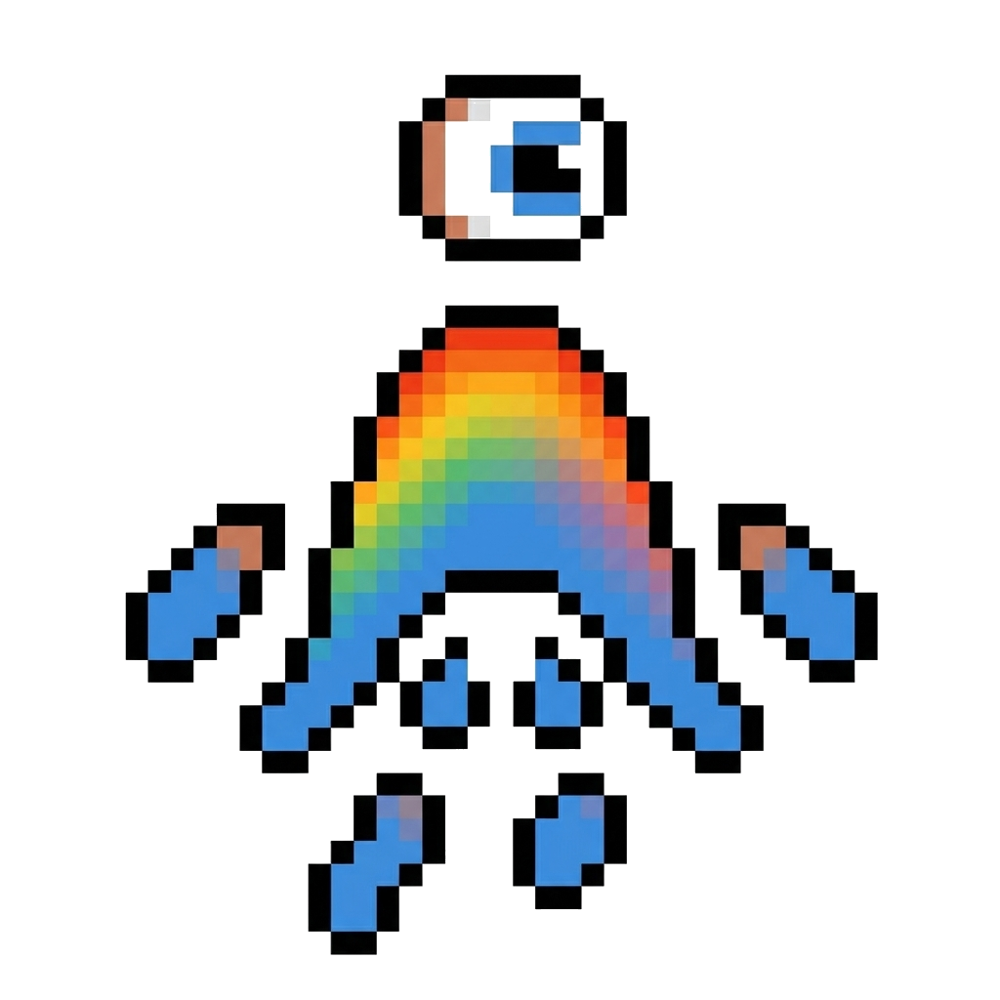
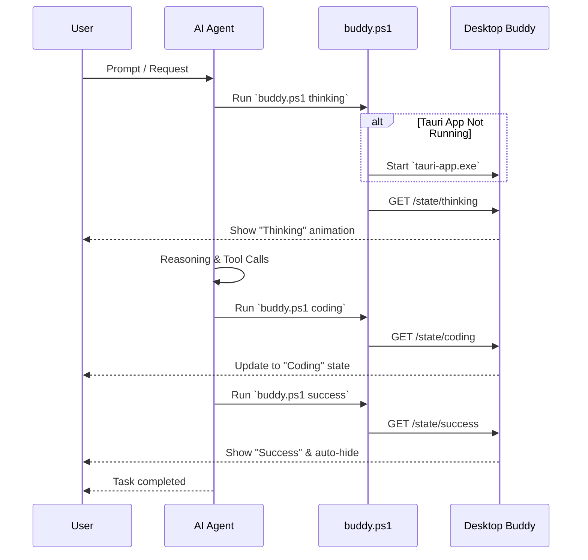

# Antigravity Buddy 🛸

> A Dynamic Island-style desktop companion for AI Agent state visualization and workspace orchestration.

[English](README.md) | [简体中文](README_zh.md)

---

Inspired by [CodeIsland](https://github.com/wxtsky/CodeIsland), Antigravity Buddy is a minimalist desktop status indicator designed specifically for AI-driven development. It bridges the gap between background AI processes and user focus with a sleek, non-intrusive "Dynamic Island" capsule.

### 🎭 Bot States

| Thinking | Coding | Success |
| :---: | :---: | :---: |
|  |  |  |
| *Energy Pulse & "..." Bubble* | *Energy Pulse & "..." Bubble* | *Laugh Shake & "Hhhhhh" Bubble* |

### ✨ Key Features
- **Modern UI**: Apple-style transparent capsule with fluid animations and micro-interactions.
- **Agent Awareness**: Real-time status feedback for `Thinking`, `Coding`, and `Success` states.
- **Smart Click-to-Focus**: Click the capsule to instantly restore, center, and focus the project IDE window.
- **Lightweight & Fast**: Built with Rust (Tauri) for minimal resource footprint.

---

### 🚀 Getting Started

#### Prerequisites
- [Node.js](https://nodejs.org/) (LTS)
- [Rust](https://rustup.rs/) (Stable)
- Windows OS (Currently optimized for Windows window management)

#### Installation
1. Clone the repository:
   ```bash
   git clone https://github.com/Tyleraltight/antigravity-buddy.git
   cd antigravity-buddy
   ```
2. Install dependencies:
   ```bash
   npm install
   ```

#### Building
To generate the optimized production executable:
```bash
npm run tauri build
```
The executable will be located at: `src-tauri/target/release/tauri-app.exe`.

---

### 🛠️ Usage

#### 1. Start the Buddy
Simply run the compiled `tauri-app.exe`. By default, it stays hidden and only appears when receiving state updates.

#### 2. Control via API
Antigravity Buddy hosts a local HTTP server on port `3003`. You can integrate it with any script or CLI tool:

- **Thinking State**: `GET http://localhost:3003/state/thinking`
- **Coding State**: `GET http://localhost:3003/state/coding`
- **Success Notification**: `GET http://localhost:3003/state/success`

#### 3. Focus Feature
When a notification is visible, **clicking the capsule** will trigger the `bring_to_front` command, which automatically locates the `Antigravity.exe` process, centers it on your screen, and brings it to the foreground.

#### 4. Architecture & Workflow



---

## License
MIT
