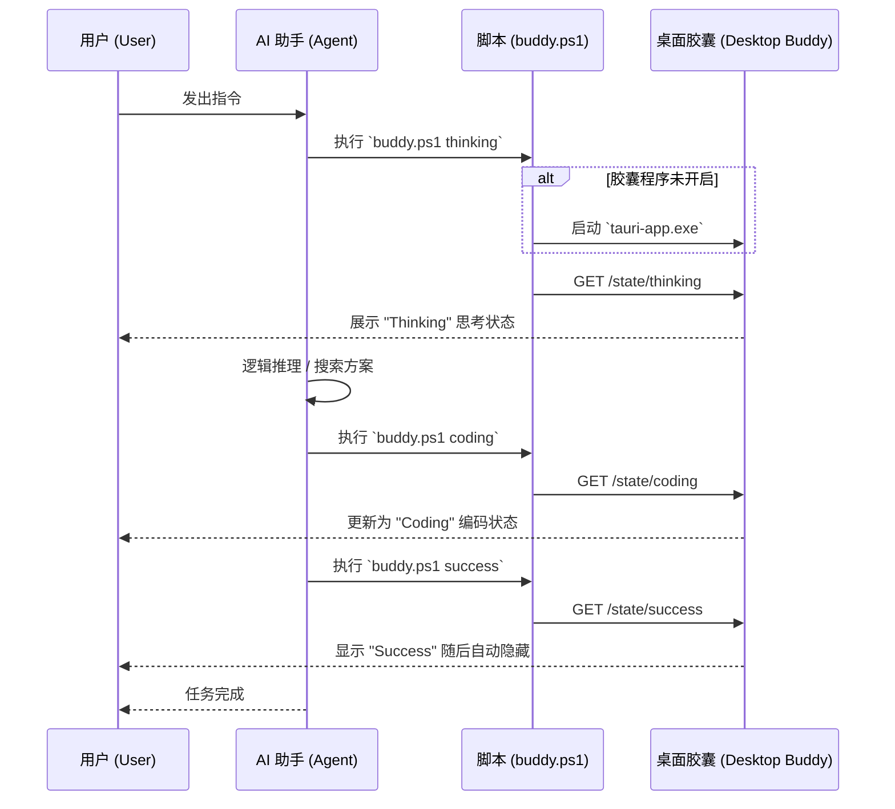

# Antigravity Buddy 🛸

> 一个受“灵动岛”启发的桌面伴侣，用于 AI Agent 状态可视化与工作区编排。

[English](README.md) | [简体中文](README_zh.md)

---

受 [CodeIsland](https://github.com/wxtsky/CodeIsland) 启发，Antigravity Buddy 是一款专为 AI 协作开发的桌面状态指示器。它利用极简的“灵动岛”外观，在不打断工作流的前提下，实时反馈 Agent 的运行状态。

### 🎭 状态展示

| 思考 (Thinking) | 编码 (Coding) | 完成 (Success) |
| :---: | :---: | :---: |
|  |  |  |
| *能量闪烁 + 思考气泡* | *能量闪烁 + 打字气泡* | *开心震动 + Hhhhhh气泡* |

### ✨ 核心特性
- **现代美学**：受 macOS 启发的透明胶囊外观，包含平滑的微交互动画。
- **状态感知**：实时同步并显示 `Thinking` (思考中), `Coding` (编码中) 和 `Success` (任务完成) 状态。
- **智能唤起**：点击状态胶囊，即可瞬间恢复、居中并激活关联的项目 IDE 窗口。
- **极致轻量**：基于 Rust & Tauri 开发，资源占用极低。

---

### 🚀 快速开始

#### 环境要求
- [Node.js](https://nodejs.org/) (LTS)
- [Rust](https://rustup.rs/) (Stable)
- Windows 操作系统 (目前针对 Windows 窗口管理进行了深度优化)

#### 安装步骤
1. 克隆仓库:
   ```bash
   git clone https://github.com/Tyleraltight/antigravity-buddy.git
   cd antigravity-buddy
   ```
2. 安装依赖:
   ```bash
   npm install
   ```

#### 构建编译
生成经过优化的生产环境运行文件：
```bash
npm run tauri build
```
编译产物位于: `src-tauri/target/release/tauri-app.exe`.

---

### 🛠️ 使用说明

#### 1. 启动程序
直接运行 `tauri-app.exe`。程序默认处于隐藏状态，仅在接收到状态更新请求时显示。

#### 2. API 集成
程序会在本地 `3003` 端口运行 HTTP 服务。你可以通过简单的 API 调用来控制小人的状态：

- **切换至思考状态**: `GET http://localhost:3003/state/thinking`
- **切换至编码状态**: `GET http://localhost:3003/state/coding`
- **显示任务完成**: `GET http://localhost:3003/state/success`

#### 3. 唤起功能
当通知显示时，**点击胶囊**将触发内置指令：寻找 `Antigravity.exe` 进程，将其窗口移至屏幕正中心并激活到前台，显著提升 Agent 协作时的操作效率。

#### 4. 架构与执行流图



---

## License
MIT
